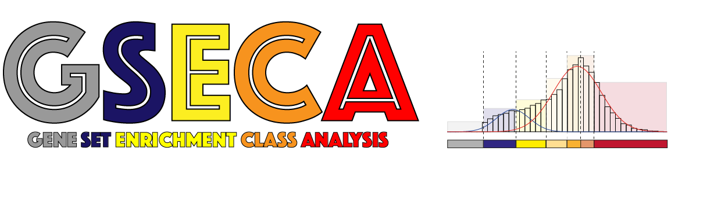
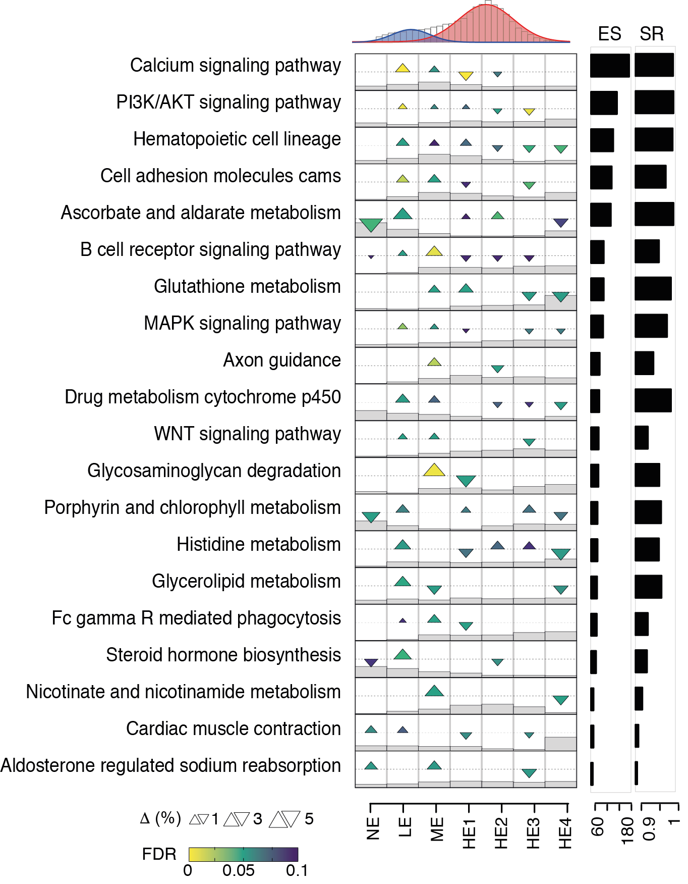

## General Notes and How to cite GSECA


[GSECA]() is a R application with a Shiny web interface that allows its execution from a web-based environment (section 5). The stand-alone version is also supported, to be run from R GUI (section 6) or from UNIX shell (section 7). Examples on how to use GSECA are provided (section 8).


## GSECA description

[GSECA]() is an **R** software that implements Gene Set Enrichment Class Analysis to detect deregulated biological processes in heterogeneous dataset using RNA sequencing experiments. Given two cohorts ( Cases / Controls ), the algorithm follows three main steps:

-  **1. Finite Mixture Modeling (FMM)**: for each sample, GSECA computes the distribution of gene expression levels and fits it with a two-components Gaussian Mixture Model, using the Expectation-Maximization algorithm. 

-  **2. Data Discretization (DD)**: once the sample-specific parameters of the FMM are estimated, GSECA implements a supervised data discretization approach, identifying 7 Expression Classes (EC). Each gene is assigned to one of these EC, accordingly to its expression level.

-  **3. Statistical Framework**: discretized data are then evaluated in a statistical framework to detect altered biological processesbetween the two cohorts. For each tested gene set, the cumulative proportions of genes in each EC are compared by Fisher's Exact test. To quantify the degree of perturbation across the ECs for all gene sets, the algorithm combines the significance level of each comparison into an enrichment score ES. To reduce false positive discoveries and correct for different sample size of the cohorts, two (optional) bootstrapping procedures are implemented, which measure the empirical P value and the success rate (SR) of each ES.

GSECA provides to the user a graphical overview of the variation of expression of each gene set across the seven classess between the two cohorts. The deregulated gene sets are visualized as EC map (see below image). The EC maps display the difference of the cumulative proportion of genes of a gene set in the seven ECs between the two cohorts as triangles, whose size is proportional to such difference. Furthermore, the upper and the lower vertex of the triangles represent enrichment and depletion in the cohort A as compared to B, respectively. Finally, GSECA orders AGSs accordingly to their ES (SR and emprical P-values, if calculated), thus obtaining the list of the most altered processes in the phenotype of interest. 


## Usage

GSECA requires as input files:

-  Gene expression matrix (".tsv", tab separated): matrix of normalized gene expression levels from RNA-seq experiments. Rows represent genes, columns represent samples and the corresponding expression levels. The first column must contain gene symbols, thus the first row must contain the label "symbol" followed by sample identifiers (e.g. barcodes). The number of classes (set to 7 by default, as reported in GSECA paper) and the gene id (HUGO symbol, ENSEMBL gene id) must be indicated in the related fields of the Shiny app or as parameters in the R function `GSECA_executor()`.

-  Sample type labels (".tsv", tab separated): an ordered list of phenotype labels (CASE / CNTR), one per row matching the order of samples given in the gene expression matrix. The first row must contain the label "x".

-  Gene sets (".gmt" file): the list of gene sets to be tested. It can be predefined by the user, or selected from a collection of pre-processed gene sets of biological pathways and diseases included in the Shiny app.


## How to run GSECA as a R shiny app in your browser


Install the **Shiny** package (and the required dependencies) in R, and use the function `runGithub()`. See the example below,
```
install.packages("shiny")
install.packages("shinyjs")
install.packages("shinythemes")
install.packages("DT")

library(shiny)

shiny::runGitHub('matteocereda/GSECA', subdir="Shiny")
```

## How to run GSECA as a stand-alone app


Clone the repository on your local machine and open R from the repository folder. To run the Shiny App, use:
```
shiny::runApp("Shiny")
```

To use GSECA functions, load source the file `Scripts/config.R` in the R Global Environment:

```
source("Scripts/config.R")
```

GSECA can be run on an R shell following the commands reported in the script `Scripts/GSECA.R`

## Examples

Example of running GSECA on an R shell. 

An example dataset is provided, which contains 100 prostate adenocarcinoma RNA-seq samples of the TCGA-PRAD dataset, obtained from the GDC data portal (https://gdc-portal.nci.nih.gov). The samples are stratified for the somatic loss of PTEN.

```
#1. Load the GSECA functions in the Global Environment
source("Scripts/config.R")

#2. Read input files 
M = read.delim("Examples/PRAD.ptenloss.M.tsv")
L = read.delim("Examples/PRAD.ptenloss.L.tsv")[,1]

#3. Run GSECA
res = GSECA_executor(  M
                     , L
                     , symbol="ensembl_gene_id"
                     , pl
                     , outdir = "Results"
                     , analysis = "PTEN"
                     , p_adj_th = 0.1
                     , nClass = 7
                     , N.CORES = 2
                     , EMPIRICAL = T
                     , BOOTSTRP = T
                     , nsim = 2
                     , PSUMLOG = 0.25
                     , PADJ    = 0.1
                     , PEMP    = 1
                     , SRATE   = 0.7
                     , toprank = 20
)


```


## Contributors

GSECA has been designed by Dr **Matteo Cereda** and developed with Andrea Lauria

Main developer: Matteo Cereda and Andrea Lauria. 

Contributing developers: None.

Contributions are always welcome!

## License

Please read the [Licence](LICENSE) first
