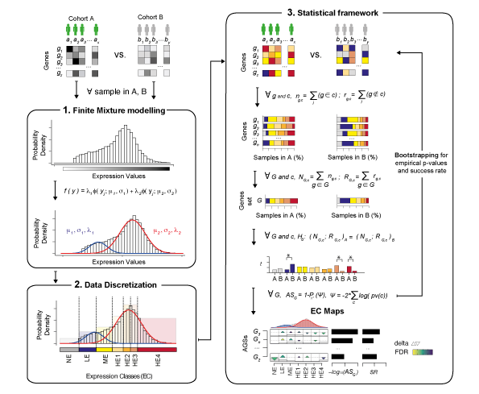

## General Notes and How to cite GSECA

[GSECA](https://doi.org/10.1093/nar/gkz1208) is a R application with a Shiny web interface. The stand-alone version can be run from R GUI or from UNIX shell. Examples on how to use GSECA are provided below. 

For further details please refer to our paper in *Nucleic Acid Research* [here](https://doi.org/10.1093/nar/gkz1208)

## GSECA description

[GSECA](https://doi.org/10.1093/nar/gkz1208) is an **R** software that implements Gene Set Enrichment Class Analysis to detect deregulated biological processes in heterogeneous dataset using RNA sequencing experiments. Given two cohorts ( Cases / Controls ), the algorithm follows three main steps:

-  **1. Finite Mixture Modeling (FMM)**: for each sample, GSECA computes the distribution of gene expression levels and fits it with a two-components Gaussian Mixture Model, using the Expectation-Maximization algorithm. 

-  **2. Data Discretization (DD)**: once the sample-specific parameters of the FMM are estimated, GSECA implements a supervised data discretization approach, identifying 7 Expression Classes (EC). Each gene is assigned to one of these EC, accordingly to its expression level.

-  **3. Statistical Framework**: discretized data are then evaluated in a statistical framework to detect altered biological processesbetween the two cohorts. For each tested gene set, the cumulative proportions of genes in each EC are compared by Fisher's Exact test. To quantify the degree of perturbation across the ECs for all gene sets, the algorithm combines the significance level of each comparison into an enrichment score ES. To reduce false positive discoveries and correct for different sample size of the cohorts, two (optional) bootstrapping procedures are implemented, which measure the empirical P value and the success rate (SR) of each ES.



GSECA provides to the user a graphical overview of the variation of expression of each gene set across the seven classess between the two cohorts. The deregulated gene sets are visualized as EC map (see below image). The EC maps display the difference of the cumulative proportion of genes of a gene set in the seven ECs between the two cohorts as triangles, whose size is proportional to such difference. Furthermore, the upper and the lower vertex of the triangles represent enrichment and depletion in the cohort A as compared to B, respectively. Finally, GSECA orders AGSs accordingly to their ES (SR and emprical P-values, if calculated), thus obtaining the list of the most altered processes in the phenotype of interest. 

For further details check our paper in *Nucleic Acid Research* [here](https://doi.org/10.1093/nar/gkz1208)

## Usage

GSECA requires as input files:

-  Gene expression matrix (".tsv", tab separated): matrix of normalized gene expression levels from RNA-seq experiments. Rows represent genes, columns represent samples and the corresponding expression levels. The first column must contain ensembl gene id, thus the first row must contain the label "ensembl_gene_id" followed by sample identifiers (e.g. barcodes). **one line one gene** be sure that your data do not contains duplicated gene ids.
**no ensg.version** if you use ensembl_gene_id, please be sure to remove the version of each ensg (i.e. ".XX") before running GSECA.
```
ensembl_gene_id TCGA.YL.A8HL TCGA.EJ.5516 TCGA.KK.A8IC TCGA.EJ.7314 ...
ENSG00000000003        12.37        23.16        11.61        13.97 ...
ENSG00000000005         0.01         0.13         0.03         0.00 ...
ENSG00000000419        23.83        24.07        32.79        21.10 ...
ENSG00000000457         4.69         4.92         2.76         2.48 ...
ENSG00000000460         0.78         0.95         0.77         0.77 ...
...

```

-  Sample type labels (".tsv", tab separated): an ordered list of phenotype labels (CASE / CNTR), one per row matching the order of samples given in the gene expression matrix. The first row must contain the label "x".
```
[1] "CASE" "CASE" "CASE" .... "CNTR" "CNTR" "CNTR" ...
```

-  Gene sets (".gmt" file): the list of gene sets to be tested. It can be predefined by the user, or selected from a collection of pre-processed gene sets of biological pathways and diseases included in the Shiny app. If you provide you own gene set list, please be sure that it satisfies all *gmt format* requirments (see details [here](https://software.broadinstitute.org/cancer/software/gsea/wiki/index.php/Data_formats#GMT:_Gene_Matrix_Transposed_file_format_.28.2A.gmt.29))

```
List of 4
 $ gene_set_A  : chr [1:61] "geneA" "geneB" "geneC" "geneD" ...
 $ gene_set_B  : chr [1:31] "geneE" "geneF" "geneB" "geneG"...
 $ gene_set_C  : chr [1:26] "geneA" "geneF" "geneH" "geneI" ...
 $ ...
 
```

## How to run GSECA as a stand-alone app


Clone the repository on your local machine and open R from the repository folder. 

```
git lfs clone https://github.com/matteocereda/GSECA.git
```

To use GSECA functions, load source the file `Scripts/config.R` in the R Global Environment:

```
source("Scripts/config.R")
```

GSECA can be run on an R shell following the commands reported in the script `Scripts/GSECA.R`

## Examples

Example of running GSECA on an R shell. 

An example dataset is provided, which contains 100 prostate adenocarcinoma RNA-seq samples (i.e. 50 cases + 50 controls) of the TCGA-PRAD dataset, obtained from the GDC data portal (https://gdc-portal.nci.nih.gov). The samples are stratified for the somatic loss of PTEN.

```
# load configurations
source("Scripts/config.R")

# Gene expression matrix & sample type
M = read.delim("Examples/PRAD.ptenloss.M.tsv")
L = read.delim("Examples/PRAD.ptenloss.L.tsv")[,1]

# Gene set list
pl = read.gmt.file("gene_sets/cereda.158.KEGG.gmt")

# Run GSECA
res = GSECA_executor(  M # Gene Expression matrix
                     , L # Sample label list
                     , pl # gene set list
                     , outdir = "Results" #outdir folder
                     , analysis = "my_analysis"# analysis name
                     , N.CORES = 2 # number of cores
                     , EMPIRICAL = T # true if empirical p-value is requested
                     , BOOTSTRP = T
                     , nsim = 2 # number of bootstrapping
                     , AS = 0.25 # AS threshold
                     , PEMP = 1 # p.emp threshold
                     , SR   = 0.7 # success rate threshold
                     , toprank = 10 # success rate threshold
                     , iphen = c("CASE", "CNTR") #  phenotype lables
)
```

These are our settings:
```
devtools::session_info()
─ Session info ───────────────────────────────────────────────────────────────────────────────────────────────────────────────────────────────────────────────────
 setting  value                       
 version  R version 3.6.1 (2019-07-05)
 os       macOS Catalina 10.15.1      
 system   x86_64, darwin15.6.0        
 ui       RStudio                     
 language (EN)                        
 collate  en_GB.UTF-8                 
 ctype    en_GB.UTF-8                 
 tz       Europe/Rome                 
 date     2019-12-31                  

─ Packages ───────────────────────────────────────────────────────────────────────────────────────────────────────────────────────────────────────────────────────
 ! package              * version    date       lib source                                  
   assertthat             0.2.1      2019-03-21 [1] CRAN (R 3.6.0)                          
   backports              1.1.5      2019-10-02 [1] CRAN (R 3.6.0)                          
   bibtex                 0.4.2      2017-06-30 [1] CRAN (R 3.6.0)                          
   Biobase              * 2.44.0     2019-05-02 [1] Bioconductor                            
   BiocGenerics         * 0.30.0     2019-05-02 [1] Bioconductor                            
   BiocManager            1.30.10    2019-11-16 [1] CRAN (R 3.6.1)                          
   BiocParallel         * 1.18.1     2019-08-06 [1] Bioconductor                            
   bit                    1.1-14     2018-05-29 [1] CRAN (R 3.6.0)                          
   bit64                  0.9-7      2017-05-08 [1] CRAN (R 3.6.0)                          
   bitops               * 1.0-6      2013-08-17 [1] CRAN (R 3.6.0)                          
   blob                   1.2.0      2019-07-09 [1] CRAN (R 3.6.0)                          
   callr                  3.4.0      2019-12-09 [1] CRAN (R 3.6.0)                          
   caTools                1.17.1.3   2019-11-30 [1] CRAN (R 3.6.0)                          
   circlize             * 0.4.8      2019-09-08 [1] CRAN (R 3.6.0)                          
   cli                    2.0.0      2019-12-09 [1] CRAN (R 3.6.0)                          
   clue                   0.3-57     2019-02-25 [1] CRAN (R 3.6.0)                          
   cluster                2.1.0      2019-06-19 [1] CRAN (R 3.6.1)                          
   codetools              0.2-16     2018-12-24 [1] CRAN (R 3.6.1)                          
   colorspace             1.4-1      2019-03-18 [1] CRAN (R 3.6.0)                          
   ComplexHeatmap       * 2.1.1      2019-10-18 [1] Github (jokergoo/ComplexHeatmap@1cb7fea)
   crayon                 1.3.4      2017-09-16 [1] CRAN (R 3.6.0)                          
   crosstalk              1.0.0      2016-12-21 [1] CRAN (R 3.6.0)                          
   data.table           * 1.12.8     2019-12-09 [1] CRAN (R 3.6.0)                          
   DBI                    1.0.0      2018-05-02 [1] CRAN (R 3.6.0)                          
   DelayedArray         * 0.10.0     2019-05-02 [1] Bioconductor                            
   dendextend             1.13.2     2019-12-02 [1] CRAN (R 3.6.0)                          
   desc                   1.2.0      2018-05-01 [1] CRAN (R 3.6.0)                          
   devtools             * 2.2.1      2019-09-24 [1] CRAN (R 3.6.0)                          
   digest                 0.6.23     2019-11-23 [1] CRAN (R 3.6.0)                          
   doParallel           * 1.0.15     2019-08-02 [1] CRAN (R 3.6.0)                          
   dplyr                  0.8.3      2019-07-04 [1] CRAN (R 3.6.0)                          
   DT                   * 0.10       2019-11-12 [1] CRAN (R 3.6.0)                          
   ellipsis               0.3.0      2019-09-20 [1] CRAN (R 3.6.0)                          
   fansi                  0.4.0      2018-10-05 [1] CRAN (R 3.6.0)                          
   farver                 2.0.1      2019-11-13 [1] CRAN (R 3.6.0)                          
   fastmap                1.0.1      2019-10-08 [1] CRAN (R 3.6.0)                          
   foreach              * 1.4.7      2019-07-27 [1] CRAN (R 3.6.0)                          
   fs                     1.3.1      2019-05-06 [1] CRAN (R 3.6.0)                          
   gbRd                   0.4-11     2012-10-01 [1] CRAN (R 3.6.0)                          
   gclus                  1.3.2      2019-01-07 [1] CRAN (R 3.6.0)                          
   gdata                  2.18.0     2017-06-06 [1] CRAN (R 3.6.0)                          
   GenomeInfoDb         * 1.20.0     2019-05-02 [1] Bioconductor                            
   GenomeInfoDbData       1.2.1      2019-09-11 [1] Bioconductor                            
   GenomicRanges        * 1.36.1     2019-09-06 [1] Bioconductor                            
   GEOquery               2.52.0     2019-05-02 [1] Bioconductor                            
   GetoptLong             0.1.7      2018-06-10 [1] CRAN (R 3.6.0)                          
   ggplot2              * 3.2.1      2019-08-10 [1] CRAN (R 3.6.0)                          
   ggpubr               * 0.2.4      2019-11-14 [1] CRAN (R 3.6.0)                          
   ggrepel              * 0.8.1      2019-05-07 [1] CRAN (R 3.6.0)                          
   ggsci                * 2.9        2018-05-14 [1] CRAN (R 3.6.0)                          
   ggsignif               0.6.0      2019-08-08 [1] CRAN (R 3.6.0)                          
   GlobalOptions          0.1.1      2019-09-30 [1] CRAN (R 3.6.0)                          
   glue                   1.3.1      2019-03-12 [1] CRAN (R 3.6.0)                          
   gplots                 3.0.1.1    2019-01-27 [1] CRAN (R 3.6.0)                          
   graph                * 1.62.0     2019-05-02 [1] Bioconductor                            
   gridExtra            * 2.3        2017-09-09 [1] CRAN (R 3.6.0)                          
   gtable               * 0.3.0      2019-03-25 [1] CRAN (R 3.6.0)                          
   gtools                 3.8.1      2018-06-26 [1] CRAN (R 3.6.0)                          
   hms                    0.5.2      2019-10-30 [1] CRAN (R 3.6.1)                          
   htmltools              0.4.0      2019-10-04 [1] CRAN (R 3.6.0)                          
   htmlwidgets            1.5.1      2019-10-08 [1] CRAN (R 3.6.0)                          
   httpuv                 1.5.2      2019-09-11 [1] CRAN (R 3.6.0)                          
   httr                   1.4.1      2019-08-05 [1] CRAN (R 3.6.0)                          
   IRanges              * 2.18.3     2019-09-24 [1] Bioconductor                            
   iterators            * 1.0.12     2019-07-26 [1] CRAN (R 3.6.0)                          
   jsonlite               1.6        2018-12-07 [1] CRAN (R 3.6.0)                          
   KernSmooth             2.23-16    2019-10-15 [1] CRAN (R 3.6.0)                          
   labeling               0.3        2014-08-23 [1] CRAN (R 3.6.0)                          
   later                  1.0.0      2019-10-04 [1] CRAN (R 3.6.0)                          
   lattice                0.20-38    2018-11-04 [1] CRAN (R 3.6.1)                          
   lazyeval               0.2.2      2019-03-15 [1] CRAN (R 3.6.0)                          
   lifecycle              0.1.0      2019-08-01 [1] CRAN (R 3.6.0)                          
   limma                  3.40.6     2019-07-26 [1] Bioconductor                            
   magrittr             * 1.5        2014-11-22 [1] CRAN (R 3.6.0)                          
   markdown               1.1        2019-08-07 [1] CRAN (R 3.6.0)                          
   MASS                   7.3-51.4   2019-03-31 [1] CRAN (R 3.6.1)                          
   Matrix                 1.2-18     2019-11-27 [1] CRAN (R 3.6.0)                          
   matrixStats          * 0.55.0     2019-09-07 [1] CRAN (R 3.6.0)                          
   memoise                1.1.0      2017-04-21 [1] CRAN (R 3.6.0)                          
   metap                * 1.2        2019-12-08 [1] CRAN (R 3.6.0)                          
   mime                   0.7        2019-06-11 [1] CRAN (R 3.6.0)                          
   mixtools             * 1.1.0      2017-03-10 [1] CRAN (R 3.6.0)                          
   mnormt                 1.5-5      2016-10-15 [1] CRAN (R 3.6.0)                          
   multcomp               1.4-11     2019-12-10 [1] CRAN (R 3.6.1)                          
   multtest               2.40.0     2019-05-02 [1] Bioconductor                            
   munsell                0.5.0      2018-06-12 [1] CRAN (R 3.6.0)                          
   mutoss                 0.1-12     2017-12-04 [1] CRAN (R 3.6.0)                          
   mvtnorm                1.0-11     2019-06-19 [1] CRAN (R 3.6.0)                          
   numDeriv               2016.8-1.1 2019-06-06 [1] CRAN (R 3.6.0)                          
   pillar                 1.4.2      2019-06-29 [1] CRAN (R 3.6.0)                          
   pkgbuild               1.0.6      2019-10-09 [1] CRAN (R 3.6.0)                          
   pkgconfig              2.0.3      2019-09-22 [1] CRAN (R 3.6.0)                          
   pkgload                1.0.2      2018-10-29 [1] CRAN (R 3.6.0)                          
   plotly               * 4.9.1      2019-11-07 [1] CRAN (R 3.6.0)                          
   plotrix                3.7-7      2019-12-05 [1] CRAN (R 3.6.0)                          
 V plyr                 * 1.8.4      2019-12-10 [1] CRAN (R 3.6.0)                          
   png                    0.1-7      2013-12-03 [1] CRAN (R 3.6.0)                          
   prettyunits            1.0.2      2015-07-13 [1] CRAN (R 3.6.0)                          
   processx               3.4.1      2019-07-18 [1] CRAN (R 3.6.0)                          
   promises               1.1.0      2019-10-04 [1] CRAN (R 3.6.0)                          
   ps                     1.3.0      2018-12-21 [1] CRAN (R 3.6.0)                          
   purrr                  0.3.3      2019-10-18 [1] CRAN (R 3.6.0)                          
   R.methodsS3          * 1.7.1      2016-02-16 [1] CRAN (R 3.6.0)                          
   R.oo                 * 1.23.0     2019-11-03 [1] CRAN (R 3.6.0)                          
   R.utils              * 2.9.2      2019-12-08 [1] CRAN (R 3.6.0)                          
   R6                     2.4.1      2019-11-12 [1] CRAN (R 3.6.0)                          
   RColorBrewer         * 1.1-2      2014-12-07 [1] CRAN (R 3.6.0)                          
   Rcpp                   1.0.3      2019-11-08 [1] CRAN (R 3.6.0)                          
   RCurl                * 1.95-4.12  2019-03-04 [1] CRAN (R 3.6.0)                          
   Rdpack                 0.11-0     2019-04-14 [1] CRAN (R 3.6.0)                          
   readr                  1.3.1      2018-12-21 [1] CRAN (R 3.6.0)                          
   registry               0.5-1      2019-03-05 [1] CRAN (R 3.6.0)                          
   remotes                2.1.0      2019-06-24 [1] CRAN (R 3.6.0)                          
   reshape2             * 1.4.3      2017-12-11 [1] CRAN (R 3.6.0)                          
   rJava                  0.9-11     2019-03-29 [1] CRAN (R 3.6.0)                          
   rjson                  0.2.20     2018-06-08 [1] CRAN (R 3.6.0)                          
   rlang                  0.4.2      2019-11-23 [1] CRAN (R 3.6.0)                          
   rlecuyer             * 0.3-5      2019-11-21 [1] CRAN (R 3.6.0)                          
   rprojroot              1.3-2      2018-01-03 [1] CRAN (R 3.6.0)                          
   RSQLite              * 2.1.4      2019-12-04 [1] CRAN (R 3.6.0)                          
   rstudioapi             0.10       2019-03-19 [1] CRAN (R 3.6.0)                          
   S4Vectors            * 0.22.1     2019-09-09 [1] Bioconductor                            
   sandwich               2.5-1      2019-04-06 [1] CRAN (R 3.6.0)                          
   scales               * 1.1.0      2019-11-18 [1] CRAN (R 3.6.0)                          
   segmented              1.1-0      2019-12-10 [1] CRAN (R 3.6.1)                          
   seriation            * 1.2-8      2019-08-27 [1] CRAN (R 3.6.0)                          
   sessioninfo            1.1.1      2018-11-05 [1] CRAN (R 3.6.0)                          
   shape                  1.4.4      2018-02-07 [1] CRAN (R 3.6.0)                          
   shiny                * 1.4.0      2019-10-10 [1] CRAN (R 3.6.0)                          
   shinyjs              * 1.0        2018-01-08 [1] CRAN (R 3.6.0)                          
   shinythemes          * 1.1.2      2018-11-06 [1] CRAN (R 3.6.0)                          
   sn                     1.5-4      2019-05-14 [1] CRAN (R 3.6.0)                          
   snow                 * 0.4-3      2018-09-14 [1] CRAN (R 3.6.0)                          
   snowfall             * 1.84-6.1   2015-10-14 [1] CRAN (R 3.6.0)                          
   SRAdb                * 1.46.0     2019-05-02 [1] Bioconductor                            
   statmod              * 1.4.32     2019-05-29 [1] CRAN (R 3.6.0)                          
   stringi                1.4.3      2019-03-12 [1] CRAN (R 3.6.0)                          
   stringr                1.4.0      2019-02-10 [1] CRAN (R 3.6.0)                          
   SummarizedExperiment * 1.14.1     2019-07-31 [1] Bioconductor                            
   survival               3.1-8      2019-12-03 [1] CRAN (R 3.6.0)                          
   testthat               2.3.1      2019-12-01 [1] CRAN (R 3.6.0)                          
   TFisher                0.2.0      2018-03-21 [1] CRAN (R 3.6.0)                          
   TH.data                1.0-10     2019-01-21 [1] CRAN (R 3.6.0)                          
   tibble                 2.1.3      2019-06-06 [1] CRAN (R 3.6.0)                          
   tidyr                * 1.0.0      2019-09-11 [1] CRAN (R 3.6.0)                          
   tidyselect             0.2.5      2018-10-11 [1] CRAN (R 3.6.0)                          
   TSP                    1.1-7      2019-05-22 [1] CRAN (R 3.6.0)                          
   usethis              * 1.5.1      2019-07-04 [1] CRAN (R 3.6.0)                          
   utf8                   1.1.4      2018-05-24 [1] CRAN (R 3.6.0)                          
   vctrs                  0.2.0      2019-07-05 [1] CRAN (R 3.6.0)                          
   viridis              * 0.5.1      2018-03-29 [1] CRAN (R 3.6.0)                          
   viridisLite          * 0.3.0      2018-02-01 [1] CRAN (R 3.6.0)                          
   withr                  2.1.2      2018-03-15 [1] CRAN (R 3.6.0)                          
   xfun                   0.11       2019-11-12 [1] CRAN (R 3.6.0)                          
   xlsx                 * 0.6.1      2018-06-11 [1] CRAN (R 3.6.0)                          
   xlsxjars               0.6.1      2014-08-22 [1] CRAN (R 3.6.0)                          
   xml2                   1.2.2      2019-08-09 [1] CRAN (R 3.6.0)                          
   xtable                 1.8-4      2019-04-21 [1] CRAN (R 3.6.0)                          
   XVector                0.24.0     2019-05-02 [1] Bioconductor                            
   yaml                   2.2.0      2018-07-25 [1] CRAN (R 3.6.0)                          
   zeallot                0.1.0      2018-01-28 [1] CRAN (R 3.6.0)                          
   zlibbioc               1.30.0     2019-05-02 [1] Bioconductor                            
   zoo                    1.8-6      2019-05-28 [1] CRAN (R 3.6.0)                          

[1] /Library/Frameworks/R.framework/Versions/3.6/Resources/library

 V ── Loaded and on-disk version mismatch.
```

To run the Shiny App, use:
```
shiny::runApp("Shiny")
```


## How to run GSECA as a R shiny app in your browser


Install the **Shiny** package (and the required dependencies) in R, and use the function `runGithub()`. See the example below,
```
install.packages("shiny")
install.packages("shinyjs")
install.packages("shinythemes")
install.packages("DT")

library(shiny)

shiny::runGitHub('matteocereda/GSECA', subdir="Shiny")
```

## Contributors

GSECA has been designed by Dr **Matteo Cereda** and developed with Andrea Lauria, Serena Peirone and Marco Del Giudice.

Main developer: Matteo Cereda, Andrea Lauria and Serena Peirone. 

Contributing developers: Marco Del Giudice.

Contributions are always welcome!

## License

Please read the [Licence](LICENSE) first
